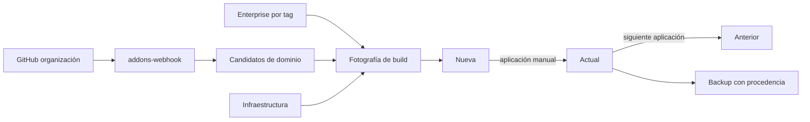

# Plan: Gestión de addons inmutables

| Nombre | Código | Versión | Fecha | Estado |
| --- | --- | --- | --- | --- |
| gestion-addons-inmutables | PLAN-001 | R01 | 2026-09-14 | Converged |

## Estado y contexto

PLAN-001 queda convergido junto con SPEC-001. `runtime/<entorno>/`,
`runtime/addons/` y `runtime/control/` son el diseño vigente; las menciones al
selector `.env` y a `envs/` identifican el modelo reemplazado, no un procedimiento operativo.

## Enfoque

La migración sustituirá el selector implícito `.env` por `runtime/desarrollo/`, `runtime/staging/` y `runtime/produccion/`. Cada runtime tendrá su composición, variables privadas, secretos, configuración y estado, mientras los stacks existentes conservarán su responsabilidad y recibirán rutas desde el runtime seleccionado.

Los repositorios de dominio se materializarán como candidatos por entorno. Enterprise será un checkout privado único seleccionado por tag inmutable. Un build manual copiará una fotografía de ambas fuentes a rutas internas de la imagen Odoo y registrará Nueva; un receptor HTTP aislado solo reconciliará candidatos de dominio. El runtime de producción incluirá el receptor en su red edge y Nginx publicará exclusivamente su ruta de GitHub.

## Verificación de la constitución

- **Stack tecnológico**: Conforme. Usa Bash, Make, Compose y Python estándar para el receptor; no incorpora frameworks ni gestores externos.
- **Principios de código**: Conforme. Conserva un stack por contenedor, español y pruebas de contratos para cada script o composición modificada.
- **Seguridad**: Conforme. El receptor no monta Docker, Odoo, filestore, Enterprise ni sus secretos; los secretos permanecen como archivos Compose.
- **Principios operativos**: Conforme. Builds, aplicación de imágenes y operaciones de módulos continúan separados y manuales; backups conservan base, filestore y procedencia.
- **Observabilidad**: Conforme. Los estados Nueva, Actual y Anterior, las verificaciones y los backups registran la procedencia completa de imagen.
- **Rendimiento**: Conforme. No modifica límites de contenedor ni incorpora procesos adicionales salvo el receptor requerido.
- **Política de dependencias**: Conforme. No agrega autoactualizadores, UI privilegiada, gestor de secretos ni backup adicional. El receptor usa una imagen Python pineada y biblioteca estándar.
- **Restricciones**: Conforme. Las migraciones mayores continúan en otro checkout; no se automatizan módulos ni validación funcional.

## Cumplimiento de requisitos no funcionales

- **Aislamiento del receptor**: Su Compose montará solo el secreto de firma, clones bare, candidatos y estado de control; las pruebas validarán la ausencia de recursos prohibidos.
- **Fallo atómico de build**: El receptor y el build toman el mismo lock por entorno. El build lee los commits publicados bajo ese lock y los exporta desde los clones bare a un directorio temporal; Nueva se escribe únicamente después de un build exitoso y de obtener el digest.
- **Metadatos de backup**: El backup leerá por entorno Actual y Anterior con sus procedencias y las guardará junto con dump y filestore.
- **Detección del modelo anterior**: Las pruebas y verificaciones rechazarán `.env` raíz operativo, `ADDONS_BRANCH` del servidor y bind mounts de addons.

## Arquitectura



`scripts/lib/contexto.sh` validará `ENTORNO=desarrollo|staging|produccion`, cargará `runtime/<entorno>/compose.env` y centralizará Compose. La ausencia de `ENTORNO` abortará antes de Docker. Los `compose.yaml` de runtime incluirán los stacks y declararán recursos compartidos con rutas de su entorno.

`runtime/addons/catalogo.txt` contendrá solo dominios. `scripts/addons.sh` mantendrá los bare clones en `runtime/addons/.repos/` y candidatos bajo `runtime/addons/custom/<entorno>/<dominio>/`; la rama se deriva del entorno. `runtime/addons/enterprise/` queda fuera de catálogo y webhook, en un tag inmutable de la línea mayor. `scripts/lib/candidate-lock.sh` coordinará al receptor y al build mediante un lock por entorno y los commits de candidato se publicarán de forma atómica.

El build exportará Enterprise y candidatos a `runtime/addons/builds/<entorno>/<identificador>/`, copiará Enterprise a `/opt/odoo/enterprise/` y dominios a `/opt/odoo/custom/`. El entrypoint pondrá Enterprise antes de los dominios. `scripts/image-state.sh` persistirá Nueva, Actual, Anterior y validación por entorno. El tag será `local/odoo:<línea>-<entorno>-<momento-UTC>-<hash-fotografía>`.

`runtime/control/compose.yaml` incluye el stack de recepción con solo la red edge y los montajes mínimos. `runtime/produccion/compose.yaml` lo incorpora para compartir esa red con Nginx. `stacks/nginx/config/addons-webhook.locations` define la única ruta publicada y `stacks/nginx/compose.yaml` la monta como configuración versionada; el receptor no entra en la red app.

## Estructura de archivos

```text
runtime/
├── desarrollo/compose.yaml                 ← nuevo: composición y estado aislados
├── desarrollo/compose.env.example           ← nuevo: plantilla privada del entorno
├── staging/compose.yaml                    ← nuevo: composición y estado aislados
├── staging/compose.env.example              ← nuevo: plantilla privada del entorno
├── produccion/compose.yaml                 ← nuevo: composición y estado aislados
├── produccion/compose.env.example           ← nuevo: plantilla privada del entorno
├── addons/catalogo.txt.example             ← nuevo: dominios permitidos
├── addons/custom/                          ← nuevo, ignorado: candidatos por entorno
├── addons/enterprise/                      ← nuevo, ignorado: checkout Enterprise
├── addons/builds/                          ← nuevo, ignorado: fotografías temporales
└── control/
    ├── compose.yaml                         ← nuevo: composición aislada del receptor
    ├── secrets/                             ← nuevo, ignorado: firma y Git de solo lectura
    └── state/                               ← nuevo, ignorado: entregas y locks
scripts/lib/contexto.sh                     ← nuevo: selección de runtime y Compose
scripts/lib/candidate-lock.sh                ← nuevo: exclusión entre receptor y build
scripts/addons.sh                           ← modificado: catálogo y candidatos por entorno
scripts/build-odoo-image.sh                 ← nuevo: fotografía, build y Nueva
scripts/image-state.sh                      ← nuevo: estados de imagen
scripts/pydeps.sh                           ← modificado: dependencias de fotografía
scripts/config-init.sh                      ← modificado: bootstrap por runtime
scripts/secrets-init.sh                     ← modificado: secretos por runtime
scripts/secrets-perms.sh                    ← modificado: permisos por runtime
scripts/verify-host.sh                      ← modificado: sin `.env` raíz
scripts/verify-stacks.sh                    ← modificado: contexto explícito
scripts/timers.sh                           ← modificado: unidades por entorno
scripts/odoo-module-operation.sh            ← modificado: operación contra Actual
scripts/odoo-report-config.sh               ← modificado: contexto explícito
stacks/addons-webhook/compose.yaml          ← nuevo: receptor HTTP restringido
stacks/addons-webhook/image/Dockerfile      ← nuevo: imagen Python pineada
stacks/addons-webhook/app/server.py         ← nuevo: firma y reconciliación acotada
stacks/addons-webhook/verify.sh             ← nuevo: contrato del receptor
stacks/odoo/compose.yaml                    ← modificado: ODOO_IMAGE sin bind mount
stacks/odoo/image/Dockerfile                ← modificado: copia fuentes fotografiadas
stacks/odoo/image/entrypoint.sh             ← modificado: addons_path interno
stacks/odoo/verify.sh                       ← modificado: imagen y procedencia
stacks/backup/compose.yaml                  ← modificado: estado de imagen y rutas runtime
stacks/backup/scripts/backup.sh             ← modificado: metadatos de imagen
stacks/backup/scripts/restore.sh            ← modificado: procedencia de restauración
stacks/backup/verify.sh                     ← modificado: respaldo y estado asociados
stacks/nginx/compose.yaml                    ← modificado: config y estado desde runtime
stacks/nginx/config/addons-webhook.locations ← nuevo: ruta pública hacia el receptor
stacks/nginx/config/server-tls.conf          ← modificado: incluye la ruta del receptor
stacks/nginx/config/server-plain.conf        ← modificado: incluye la ruta del receptor
stacks/postgres/compose.yaml                 ← modificado: config y estado desde runtime
stacks/certbot/compose.yaml                  ← modificado: config y estado desde runtime
stacks/cloudflared/compose.yaml              ← modificado: config y estado desde runtime
stacks/dnsmasq/compose.yaml                  ← modificado: config y estado desde runtime
stacks/prometheus/compose.yaml               ← modificado: config y estado desde runtime
stacks/loki/compose.yaml                     ← modificado: config y estado desde runtime
stacks/grafana/compose.yaml                  ← modificado: config y estado desde runtime
stacks/alloy/compose.yaml                    ← modificado: config y estado desde runtime
Makefile                                    ← modificado: ENTORNO obligatorio y nuevos verbos
.make/layouts.mk                            ← modificado: Compose mediante contexto
.gitignore                                  ← modificado: runtime mutable
tests/test_contextos.sh                     ← nuevo: selección y aislamiento
tests/test_build_odoo_image.sh              ← nuevo: fotografía y Nueva atómica
tests/test_image_state.sh                   ← nuevo: transiciones de imagen
tests/test_webhook_addons.sh                ← nuevo: firma, allowlist e idempotencia
tests/test_addons.sh                        ← modificado: candidatos por entorno
tests/test_compose.sh                       ← modificado: runtimes y sin bind mounts
tests/test_backup.sh                        ← modificado: metadatos de imagen
tests/test_scripts.sh                       ← modificado: bootstrap por runtime
tests/test_verify.sh                        ← modificado: sin `.env` raíz
docs/modulos/especificacion-gestion-addons.md ← modificado: contratos implementados
docs/modulos/gestionar-catalogo-addons.md   ← nuevo: alta y retiro de repositorios
docs/modulos/construir-y-aplicar-imagen.md  ← nuevo: build y aplicación manual
docs/modulos/validar-promocion.md           ← nuevo: promoción serializada
docs/entorno/levantar-desarrollo.md         ← modificado: runtime explícito
docs/entorno/levantar-staging.md            ← modificado: runtime y descarte
docs/entorno/levantar-produccion.md         ← modificado: runtime explícito
docs/backup-restore/restore-staging.md      ← modificado: descarte y restore
docs/operacion/operar-odoo.md               ← modificado: imagen Actual
docs/operacion/operar-backups.md            ← modificado: procedencia de imagen
docs/operacion/operar-webhook-addons.md     ← nuevo: operación del receptor
docs/credenciales/configurar-webhook-github.md ← nuevo: firma y publicación
```

## Modelo de datos

Cada `runtime/<entorno>/state/images.json` contendrá Nueva, Actual y Anterior. Cada referencia guarda tag, digest, línea Odoo, imagen base, commit de infraestructura, tag y commit Enterprise, mapa de dominios y dependencia resuelta. La validación actual es una nota asociada a Actual.

El estado de webhook guarda identificador de entrega, repositorio, rama, commit, entorno, instante y resultado. Una entrega repetida para el mismo commit deja el candidato en el mismo estado.

## Contratos de interfaz

- **Contexto**: `ENTORNO=desarrollo|staging|produccion make <verbo>`; cualquier otro valor o ausencia falla antes de Compose.
- **Catálogo**: cada línea no vacía contiene una URL de repositorio de dominio; entorno determina la rama y el destino.
- **Enterprise**: el checkout debe estar en un tag inmutable; un tag o commit no resoluble hace fallar el build sin tocar estados.
- **Build**: `ENTORNO=<entorno> make build` reemplaza únicamente Nueva, sin recrear servicios ni operar módulos.
- **Aplicación**: `ENTORNO=<entorno> make apply-image` mueve Nueva a Actual y Actual a Anterior; producción exige backup previo.
- **Webhook**: `POST` de GitHub valida HMAC y acepta solo `push` de catálogo y ramas de integración; eventos ignorados responden éxito sin mutar candidatos.

## Dependencias

No se agregan paquetes de aplicación ni servicios de gestión. El receptor usa Python estándar dentro de una imagen Python con tag explícito; Compose, Git y Docker ya existen en el modelo operativo.

## Riesgos y desconocidos

- La transición de configuraciones y secretos existentes debe crear plantillas y rutas runtime antes de retirar las rutas globales.
- El catálogo actual por categorías requiere una migración explícita a repositorios de dominio.
- La imagen oficial declara `/mnt/extra-addons` como volumen; las fuentes se copian a rutas internas para garantizar inmutabilidad.
- El receptor necesita una entrega GitHub publicada por Nginx y un secreto de firma cargado manualmente, sin abrir una superficie administrativa nueva.
