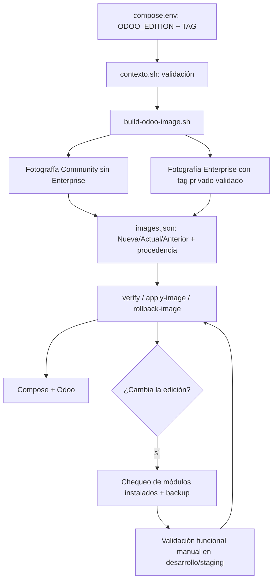

# Plan: Edición Community o Enterprise

| Nombre | Código | Versión | Fecha | Estado |
| --- | --- | --- | --- | --- |
| Edición Community o Enterprise | PLAN-002 | R02 | 2026-09-16 | Converged |

## Estado y contexto

PLAN-002 queda convergido junto con SPEC-002. La configuración vigente es plana y
vive en `runtime/<entorno>/compose.env`; las referencias a estados históricos sin
edición documentan compatibilidad de restore, no rutas operativas alternativas.

## Enfoque

La edición se seleccionará desde el `compose.env` plano de cada runtime mediante
`ODOO_EDITION` y `TAG`. El contexto validará ambos valores antes de operar; el build
construirá una fotografía Community sin código Enterprise o una fotografía Enterprise
con un tag privado anotado e inmutable.

La edición formará parte de la procedencia de cada imagen y de las transiciones de
`Nueva`, `Actual` y `Anterior`. La incorporación o retiro de Enterprise no será una
operación automática de módulos: el repositorio aportará guardas y un chequeo de base,
mientras que la migración funcional continuará siendo manual y validada en desarrollo
y staging.

## Verificación de la constitución

- **Stack tecnológico**: compatible con Bash, Make, Docker Compose, PostgreSQL y los
  tests Bash existentes; no requiere paquetes ni servicios nuevos.
- **Principios de código**: los scripts, mensajes, comentarios y documentación nuevos
  estarán en español; cada cambio de script tendrá regresiones; la configuración seguirá
  siendo plana y los verbos existentes (`build`, `apply-image`, `rollback-image`,
  `verify`) conservarán su propósito.
- **Seguridad**: Community no pedirá credenciales Enterprise; Enterprise continuará
  fuera del repositorio público y se copiará solo desde el checkout privado validado; no
  se agregan secretos, puertos, socket Docker ni privilegios a servicios expuestos.
- **Principios operativos**: la elección de edición será explícita; la aplicación de
  imagen y las operaciones de módulos seguirán siendo manuales; todo cambio de edición
  exigirá backup antes de producción y respetará la frontera de rollback después de una
  operación funcional.
- **Observabilidad**: `images.json`, backup y restore conservarán edición, tag y
  procedencia; `make verify` comprobará la edición de la imagen activa sin duplicar las
  expectativas propias de cada stack.
- **Rendimiento**: N/A; el cambio no altera límites, workers, conexiones ni rutas de
  servicio.
- **Política de dependencias**: no se incorporan gestores, servicios ni librerías; se
  reutilizan Compose, la API ORM de Odoo y los stubs de tests existentes.
- **Restricciones**: se mantiene un único servidor, la separación por runtime, la
  validación previa en desarrollo/staging y el carácter manual de las migraciones
  funcionales.

## Cumplimiento de requisitos no funcionales

- **Configuración únicamente con `ODOO_EDITION` y `TAG`**: ambos valores se agregan a
  las plantillas `runtime/*/compose.env.example`; no se crea un archivo de perfiles ni
  otra fuente de configuración.
- **Prefijo de tag coherente**: el contexto y el build aceptan `19.0-ce-...` solo para
  Community y `19.0-ee-...` solo para Enterprise.
- **Procedencia completa**: cada fotografía registra edición, `edition_tag`, referencia
  de imagen, digest, línea de Odoo, commit de infraestructura, commits de addons y
  momento de construcción; Enterprise agrega tag, commit y módulos disponibles.
- **Sin migración funcional automática**: el chequeo de transición solo lee la base y
  bloquea un destino inseguro; no instala, actualiza, desinstala ni transforma módulos.
- **Backup antes de producción**: `apply-image` conservará el backup previo existente,
  `backup.sh` registrará el identificador del snapshot asociado y la transición de
  edición no podrá saltarse esa guarda.
- **Compatibilidad histórica**: los estados Enterprise sin `edition` se normalizarán
  como Enterprise cuando tengan `enterprise_tag` y `enterprise_commit` válidos; los
  nuevos estados Community declararán la edición explícitamente.

## Arquitectura

`contexto.sh` cargará el archivo plano del entorno y validará la edición y el tag antes
de que un script llegue a Compose. `build-odoo-image.sh` derivará una fotografía única:
para Community creará un contexto Enterprise vacío y no copiará código privado; para
Enterprise validará y archivará el checkout privado seleccionado. El entrypoint solo
agregará Enterprise al `addons_path` si el contexto contiene manifiestos.

La procedencia distinguirá la referencia interna de imagen de la etiqueta de edición:
`TAG` se guardará como `edition_tag`, mientras que la etiqueta local inmutable generada
por el build se guardará como `tag`. En Enterprise, `edition_tag` y el tag Git privado
seleccionado deberán coincidir; en Community `edition_tag` identifica la release
Community y no representa un checkout Enterprise.

`image-state.sh` validará la edición de las ranuras y del runtime antes de promover o
revertir. Un cambio Community/Enterprise será una frontera de rollback: la transición
requiere el chequeo de la base, un backup previo identificable y validación manual; un
rollback ordinario no podrá saltar a una imagen de otra edición.

En producción, `Makefile` conservará la ejecución de `backup-run` antes de `apply`.
`stacks/backup/scripts/backup.sh` escribirá atómicamente una metadata de runtime con el
ID del snapshot, la edición y la imagen `Actual` respaldada. `image-state.sh` exigirá
esa metadata cuando detecte un cambio de edición y verificará que corresponda al
`Actual` vigente antes de promover.



## Estructura de archivos

```text
.specs/002-edicion-community-enterprise/
└── plan.md                                      ← nuevo: este plan

scripts/
├── lib/contexto.sh                              ← modificado: valida edición y tag
├── addons.sh                                    ← modificado: usa TAG normalizado para Enterprise
├── build-odoo-image.sh                          ← modificado: ramas Community/Enterprise y metadata
├── image-state.sh                               ← modificado: schema, compatibilidad y guardas
└── odoo-edition-check.sh                        ← nuevo: chequeo de transición contra la base

runtime/
├── desarrollo/compose.env.example               ← modificado: ODOO_EDITION y TAG
├── staging/compose.env.example                  ← modificado: ODOO_EDITION y TAG
└── produccion/compose.env.example               ← modificado: ODOO_EDITION y TAG

stacks/odoo/
├── image/Dockerfile                             ← modificado: contexto Enterprise vacío permitido
├── image/entrypoint.sh                          ← modificado: no agrega Enterprise vacío
└── verify.sh                                    ← modificado: edición y procedencia coherentes

Makefile                                         ← modificado: target/guarda del chequeo de edición
ARCHITECTURE.md                                  ← modificado: Community/Enterprise opcional

stacks/backup/
└── scripts/backup.sh                             ← modificado: registra snapshot asociado

tests/
├── test_build_odoo_image.sh                     ← modificado: escenarios Community y Enterprise
├── test_image_state.sh                          ← modificado: schema y transiciones por edición
├── test_addons.sh                                ← modificado: TAG normalizado y Enterprise
├── test_compose.sh                               ← modificado: variables de edición en templates
├── test_contextos.sh                             ← modificado: fixtures con edición y tag válidos
├── test_addon_operations.sh                      ← modificado: fixture de contexto del runtime
├── test_backup.sh                                 ← modificado: fixture de contexto del runtime
├── test_report_config.sh                         ← modificado: fixture de contexto del runtime
├── test_scripts.sh                                ← modificado: fixtures de contexto del runtime
├── test_verify.sh                                ← modificado: mismatch de edición
└── test_edition_transition.sh                    ← nuevo: guardas de transición de base

docs/
├── README.md                                    ← modificado: contrato de selección de edición
├── modulos/especificacion-gestion-addons.md     ← modificado: edición como parte de imagen
├── modulos/gestionar-enterprise.md              ← modificado: flujo Git/tag y variante Community
├── modulos/construir-y-aplicar-imagen.md        ← modificado: build según edición
├── modulos/validar-promocion.md                 ← modificado: frontera de transición
├── entorno/levantar-desarrollo.md               ← modificado: configuración plana
├── entorno/levantar-staging.md                  ← modificado: configuración plana
├── entorno/levantar-produccion.md               ← modificado: configuración plana
├── backup-restore/restore-staging.md            ← modificado: restore por edición
├── backup-restore/restore-perdida-total.md      ← modificado: procedencia sin ZIP obligatorio
└── backup-restore/migrar-deployment-externo.md  ← modificado: selección de edición
```

La carpeta `docs/` es el resultado de la migración de la documentación v2 y queda como
destino canónico. No se modifican los archivos privados `runtime/*/compose.env`, el
checkout Enterprise ni los secretos.

## Modelo de datos

Cada slot de `runtime/<entorno>/state/images.json` conserva una fotografía con estos
campos nuevos o ajustados:

- `edition`: `community` o `enterprise`.
- `edition_tag`: valor configurado en `TAG`, con prefijo compatible.
- `tag`: referencia interna de imagen generada por el build.
- `digest`, `odoo_version`, `base_image`, `infra_commit`, `addons` y `built_at`.
- `enterprise_tag` y `enterprise_commit`: obligatorios en Enterprise y `null` en
  Community; se mantienen para interpretar estados anteriores.
- `enterprise_modules`: nombres técnicos derivados de los manifiestos del snapshot
  Enterprise; lista vacía en Community. Se usa como inventario de comparación, pero la
  base de datos es la fuente de verdad sobre módulos instalados.
- `runtime/<entorno>/state/meta/last-backup.json`: metadata de runtime no versionada con `snapshot_id`,
  `entorno`, `edition`, `actual_tag` y `created_at`; se exige solo para un cambio de
  edición en producción.

Las ranuras `Nueva`, `Actual` y `Anterior` siguen siendo independientes por runtime.
El estado de validación y el bloqueo posterior a operaciones de módulos se conservan.
Una transición entre ediciones no cambia automáticamente esos módulos ni los datos de
la base.

## Contratos de interfaz

### Configuración del runtime

Cada `compose.env` debe declarar:

```ini
ODOO_EDITION=community
TAG=19.0-ce-YYYY-MM-DD
```

o:

```ini
ODOO_EDITION=enterprise
TAG=19.0-ee-YYYY-MM-DD
```

No se interpretan bloques `[community]` o `[enterprise]`; la elección se hace cambiando
el valor de esas dos variables.

### Build

- Community: acepta candidatos y dependencias válidos sin checkout Enterprise; deja
  `enterprise_tag`, `enterprise_commit` y `enterprise_modules` vacíos o nulos.
- Enterprise: exige checkout limpio, tag anotado, tag coherente con `TAG` y commit
  resoluble; registra todos los datos Enterprise.
- En ambos casos, la publicación de `Nueva` ocurre solo después de build y digest
  exitosos.

### Chequeo de edición

`ENTORNO=<entorno> scripts/odoo-edition-check.sh --destino <community|enterprise>`
lee el runtime y consulta la base sin modificarla. Devuelve `0` si el destino es
compatible, `1` si el destino Community encuentra módulos Enterprise instalados o si
falta el inventario Enterprise necesario para comprobarlos, y `2` ante uso inválido,
contexto incompleto o error de infraestructura. Informa los módulos detectados en
salida para el operador.

### Transiciones de imagen

- `verify`, `apply-image` y `rollback-image` rechazan una ranura cuya `edition` no
  coincide con `ODOO_EDITION`.
- Si `Nueva` cambia de edición respecto de `Actual`, `apply-image` exige backup previo,
  verifica `runtime/<entorno>/state/meta/last-backup.json`, ejecuta el chequeo de transición y deja
  registrada la nueva edición.
- Si el destino es Community, el chequeo consulta la intersección entre módulos
  Enterprise instalados en la base y `enterprise_modules` de la imagen Enterprise
  vigente; sin inventario histórico suficiente, bloquea conservadoramente.
- Si `Anterior` pertenece a otra edición, `rollback-image` no la reactiva; se debe
  restaurar el backup y repetir la transición validada.

### Compatibilidad histórica

Los lectores de estado aceptan una fotografía anterior sin `edition` si sus campos
Enterprise existentes permiten inferir `enterprise`. Las nuevas escrituras siempre
incluyen `edition` y `edition_tag`.

## Dependencias

Ninguna nueva. Se reutilizan Bash, Make, Docker Compose, PostgreSQL, la API ORM de Odoo,
Python inline ya presente en los scripts y los stubs de `tests/`.

## Riesgos y desconocidos

- **La base puede conservar datos residuales de módulos Enterprise aunque estén
  desinstalados**: el chequeo bloqueará módulos instalados y la validación sobre una
  copia de staging seguirá siendo obligatoria; la limpieza funcional queda manual.
- **Los estados históricos no tienen edición explícita**: se normalizarán por la
  presencia conjunta de tag y commit Enterprise, y se cubrirá con tests de restore.
- **`TAG` Community no es un tag Git Enterprise**: se documentará como identificador de
  release Community y no se usará para buscar un checkout privado.
- **Un operador puede cambiar la configuración y levantar una imagen vieja directamente
  con Compose**: `verify` detectará la discrepancia y los runbooks usarán los targets
  protegidos del Makefile.
