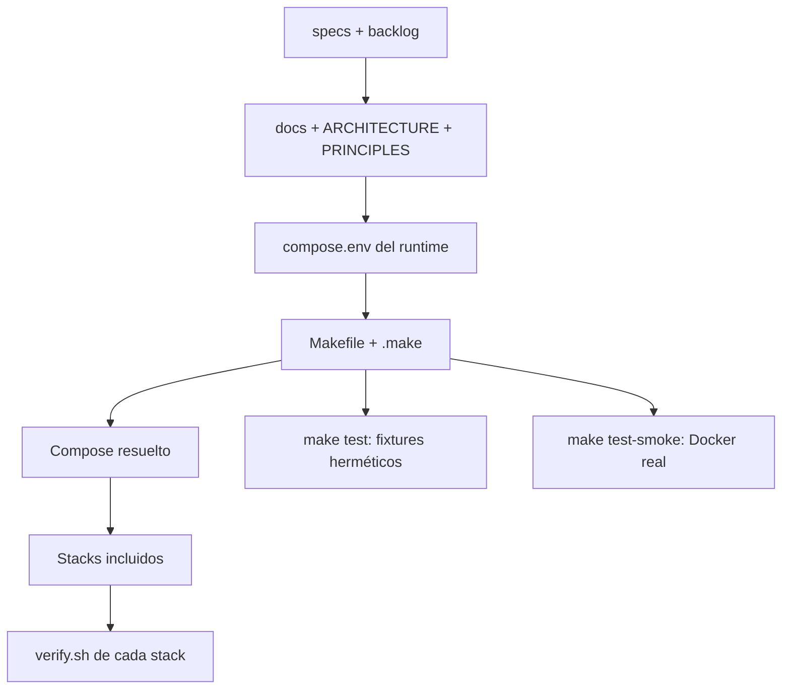

# Plan: Correcciones integrales del backlog

| Nombre | Código | Versión | Fecha | Estado |
| --- | --- | --- | --- | --- |
| Correcciones integrales del backlog | PLAN-003 | R00 | 2026-09-17 | Approved |

## Enfoque

Resolver los 41 ítems en lotes pequeños por contrato: primero documentación y
trazabilidad, después host y scripts, luego stacks, y finalmente la suite de pruebas.
Cada lote conservará los verbos existentes, modificará solo las rutas versionadas
necesarias y tendrá una verificación estática o live explícita antes de su commit.

`addons-webhook` se incorporará al registro común de stacks de Make. Sus targets
puntuales tendrán la misma interfaz que los demás contenedores; la composición seguirá
decidiendo en qué entornos existe el servicio y `make up`/`make down` conservarán el
ciclo de vida global.

## Verificación de la constitución

- **Stack tecnológico**: compatible con Bash, Make, Docker Compose, PostgreSQL y los
  tests Bash existentes; el smoke test reutilizará las imágenes y binarios de los
  stacks, sin incorporar un framework nuevo.
- **Principios de código**: los cambios de scripts, Make y documentación estarán en
  español; cada contrato modificado tendrá una regresión; los comentarios se
  normalizarán al formato obligatorio y se conservarán los verbos existentes.
- **Seguridad**: no se moverán secretos ni datos operativos; el endurecimiento de
  `addons-webhook` y Alloy se limita a los permisos necesarios y queda verificado; no
  se agregan puertos públicos, credenciales por entorno ni servicios auxiliares.
- **Principios operativos**: los targets siguen requiriendo `ENTORNO`; la presencia de
  un stack se determina por la composición; las operaciones funcionales, imágenes,
  backups y restores siguen siendo decisiones explícitas del operador.
- **Observabilidad**: cada stack conserva su `verify.sh`; `make verify` solo orquesta;
  los checks de retención, perfiles y configuración efectiva se ejecutan contra la
  misma composición que usa el runtime.
- **Rendimiento**: no se modifican workers ni límites de producción; los smoke tests
  se ejecutan como una operación separada y no levantan servicios durante `make test`.
- **Política de dependencias**: no se agregan paquetes ni gestores; se reutilizan
  utilidades ya presentes, Docker Compose y los binarios de las imágenes existentes.
- **Restricciones**: se mantiene el único servidor, la separación por runtime, la
  recuperación manual y la documentación de `docs/` como destino canónico.

## Cumplimiento de requisitos no funcionales

- **No modificar secretos, datos, checkouts Enterprise ni estado operativo**: los tests
  trabajarán sobre copias temporales; la migración de referencias legacy será
  documental o de código versionado y nunca borrará datos detectados automáticamente.
- **Verificación por lote sin daemon ni red**: `make test`, `bash -n` y las pruebas
  estáticas cubrirán cada lote; `make test-smoke` será explícitamente separado y
  documentará su requisito de Docker y red cuando corresponda.
- **Conservar verbos operativos**: los targets existentes mantienen nombre y función;
  `addons-webhook-*` se suma al mismo sexteto y `integrity-check` se expone sin
  reemplazar operaciones previas.
- **Commits separados por frente**: el orden de implementación separará docs,
  host/scripts, stacks, tests y trazabilidad, dejando cada lote revisable y reversible.

## Arquitectura

La fuente de operación seguirá siendo `runtime/<entorno>/compose.env` más la
composición del runtime. `Makefile` y `.make/main.mk` derivarán el registro visible de
stacks; `layouts.mk` generará los targets uniformes y `verify-stacks.sh` descubrirá los
verificadores sin duplicar expectativas. Un stack que no esté incluido en un entorno se
reportará como ausente; no se inventará una configuración alternativa para que su
target dé verde.

Los procedimientos y la arquitectura se alinearán con `runtime/`, `stacks/` y
`runtime/control`. Los fallbacks legacy se retirarán o quedarán aislados y
documentados como compatibilidad histórica. `integrity-check.sh`, `pydeps.sh`,
`vscode-workspace.sh` y las operaciones one-off recibirán el mismo contexto y
aislamiento que el resto del runtime.

La suite tendrá dos caminos: `make test` usará fixtures y temporales herméticos, sin
daemon ni red; `make test-smoke` validará con Docker real el build de Odoo y las
configuraciones efectivas de los servicios que dispongan de herramienta de validación.
Los stubs fallarán por defecto ante invocaciones no preparadas, para que una prueba no
quede verde por una respuesta implícita.



## Lotes de implementación y trazabilidad

| Lote | Ítems | Resultado principal |
| --- | --- | --- |
| 1. Contratos y documentación | B001–B004, B015–B018, B023, B035–B041 | Rutas actuales, edición, runtime/control, releases y Spec-Flow coherentes. |
| 2. Host y scripts | B005–B014 | Validaciones fail-closed, contexto único, aislamiento y targets auxiliares. |
| 3. Stacks y Make | B019–B024, B032–B034 | Retención, privilegios, perfiles, comentarios e interfaz completa de stacks. |
| 4. Suite de pruebas | B025–B031 | Tests herméticos, cobertura directa, stubs estrictos y smoke tests separados. |

Cada lote se implementará, verificará, convergerá y commiteará antes de comenzar el
siguiente. El backlog marcará un ítem completo solo cuando su verificación y su
documentación asociada estén cerradas.

## Estructura de archivos

```text
README.md                                      ← modificado: modelo runtime y dependencias de test
PRINCIPLES.md                                  ← modificado: rutas y política operativa vigentes
ARCHITECTURE.md                                ← modificado: inventario, runtime/control y legacy histórico
CONTRIBUTING.md                                 ← modificado: política de releases y verificación
.gitignore                                     ← modificado: reglas coherentes con runtime/
Makefile                                       ← modificado: targets, agrupaciones, integrity-check y smoke
CHANGELOG.md                                   ← eliminado: los cambios se registran en releases
addons/requirements.txt.example                ← eliminado: plantilla legacy fuera de runtime/

.make/
└── main.mk                                    ← modificado: registro de stacks y agrupaciones

host/
└── systemd/notify@.service                     ← modificado: red y timeout de notificación

scripts/
├── build-odoo-image.sh                          ← modificado: toma pines desde runtime/addons
├── failure-notify.sh                            ← modificado: errores y disponibilidad de red
├── integrity-check.sh                           ← modificado: contexto ENTORNO y contrato Make
├── odoo-module-operation.sh                     ← modificado: nombres y lock por proyecto/entorno
├── pydeps.sh                                    ← modificado: manifiestos inválidos y sin fallback legacy
├── timers.sh                                    ← modificado: aislamiento de unidades y locks
├── verify-host.sh                               ← modificado: JSON y opciones efectivas del daemon
├── verify-stacks.sh                             ← modificado: perfiles y stack ausente/caído
├── vscode-workspace.sh                          ← modificado: folders bajo runtime/addons
├── lib/candidate-lock.sh                        ← modificado: lock acotado al runtime
├── lib/contexto.sh                              ← modificado: contexto compartido por auxiliares
└── lib/verify.sh                                ← modificado: helpers para checks estructurales

runtime/addons/
└── requirements.txt.example                     ← nuevo: plantilla de pines Python vigente

stacks/
├── addons-webhook/compose.yaml                  ← modificado: identidad, usuario y permisos mínimos
├── addons-webhook/app/server.py                 ← modificado: locks por proyecto y entorno
├── addons-webhook/verify.sh                     ← modificado: contrato de seguridad y targets
├── alloy/compose.yaml                           ← modificado: montajes documentados y mínimos
├── alloy/scripts/monitoring-role.sh             ← modificado: comentarios y validación
├── alloy/verify.sh                              ← modificado: límites verificables
├── backup/compose.yaml                          ← modificado: comentarios y retención coherente
├── backup/config/r2.env.example                  ← modificado: separación del entorno Compose
├── backup/scripts/backup.sh                     ← modificado: contratos de runtime
├── backup/scripts/restore.sh                    ← modificado: fallback state aislado
├── backup/verify.sh                             ← modificado: perfiles y procedencia
├── certbot/compose.yaml                         ← modificado: comentarios y perfil verificable
├── certbot/scripts/cert.sh                      ← modificado: comentarios y errores
├── certbot/scripts/wrapper.sh                   ← modificado: comentarios y errores
├── certbot/verify.sh                            ← modificado: perfil inactivo
├── cloudflared/compose.yaml                     ← modificado: comentarios normalizados
├── cloudflared/verify.sh                        ← modificado: contrato directo
├── dnsmasq/compose.yaml                         ← modificado: perfil y límites documentados
├── dnsmasq/config/dnsmasq.conf.example           ← modificado: referencia al entorno vigente
├── dnsmasq/verify.sh                            ← modificado: perfil inactivo
├── grafana/compose.yaml                         ← modificado: configuración efectiva
├── grafana/config/grafana.ini                   ← modificado: referencia al entorno vigente
├── grafana/verify.sh                            ← modificado: contrato directo
├── loki/compose.yaml                            ← modificado: retención efectiva
├── loki/config/loki.yaml                        ← modificado: retención única y explícita
├── loki/verify.sh                               ← modificado: expectativa de retención
├── nginx/compose.yaml                           ← modificado: comentarios normalizados
├── nginx/config/server-tls.conf.example         ← modificado: referencia al entorno vigente
├── nginx/verify.sh                              ← modificado: contrato directo
├── odoo/compose.yaml                            ← modificado: comentarios normalizados
├── odoo/config/odoo.conf                        ← modificado: referencia al entorno vigente
├── odoo/image/entrypoint.sh                     ← modificado: comentarios normalizados
├── odoo/verify.sh                               ← modificado: contrato directo
├── postgres/compose.yaml                        ← modificado: comentarios normalizados
├── postgres/verify.sh                           ← modificado: contrato directo
├── prometheus/compose.yaml                      ← modificado: comentarios normalizados
└── prometheus/verify.sh                         ← modificado: contrato directo

tests/
├── test_addon_operations.sh                     ← modificado: nombre one-off aislado
├── lib.sh                                       ← modificado: temporales y snapshots byte a byte
├── stubs/docker                                 ← modificado: fixtures obligatorios y fallos por defecto
├── stubs/systemctl                              ← modificado: fixtures obligatorios y fallos por defecto
├── test_architecture.sh                         ← modificado: rutas e inventario actuales
├── test_addons.sh                                ← modificado: contratos de catálogo y rutas actuales
├── test_backup.sh                               ← modificado: estado temporal y fallback histórico
├── test_build_odoo_image.sh                     ← modificado: no borrar runtime operativo
├── test_compose.sh                               ← modificado: composición, perfiles y edición
├── test_contextos.sh                             ← modificado: contexto en auxiliares
├── test_image_state.sh                           ← modificado: preservación de estado
├── test_pydeps.sh                                ← modificado: manifiestos inválidos
├── test_scripts.sh                               ← modificado: integrity, workspace y preparación
├── test_verify.sh                                ← modificado: host, stacks y expectativas directas
├── test_verify_stacks.sh                         ← modificado: perfiles y cobertura del orquestador
├── test_webhook_addons.sh                        ← modificado: targets y contrato del receptor
└── test_docker_smoke.sh                          ← nuevo: build Odoo y validaciones reales de herramientas

docs/
├── README.md                                    ← modificado: mapa y separación test/verify/smoke
├── reporte-pr-15.md                             ← modificado: marcado como histórico
├── backup-restore/migrar-deployment-externo.md  ← modificado: rutas y edición vigentes
├── backup-restore/realizar-backup.md            ← modificado: estado recuperable
├── backup-restore/restore-perdida-total.md      ← modificado: reconstrucción sin borrar legacy
├── backup-restore/restore-staging.md             ← modificado: runtime/control y perfiles
├── entorno/levantar-desarrollo.md               ← modificado: runtime actual
├── entorno/levantar-produccion.md               ← modificado: runtime actual
├── entorno/levantar-staging.md                  ← modificado: runtime actual
├── modulos/construir-y-aplicar-imagen.md        ← modificado: catálogo y edición
├── modulos/especificacion-gestion-addons.md     ← modificado: layout actual
├── modulos/gestionar-catalogo-addons.md         ← modificado: catálogo actual
├── modulos/gestionar-enterprise.md              ← modificado: flujo sin ZIP
├── modulos/gestionar-fork.md                    ← modificado: runtime/addons
├── modulos/validar-promocion.md                 ← modificado: targets y verificación
├── operacion/configurar-docker-host.md          ← modificado: host-init y compose CLI
├── operacion/operar-backups.md                  ← modificado: recovery y legacy
├── operacion/operar-db.md                       ← modificado: estado del runtime seleccionado
├── operacion/operar-observability.md             ← modificado: validaciones y smoke de herramientas
├── operacion/operar-webhook-addons.md           ← modificado: targets propios de Make
├── credenciales/configurar-zeptomail.md         ← modificado: compose.env de producción
└── credenciales/rotar-password-zeptomail.md     ← modificado: rutas de secretos y entorno

.specs/
├── backlog.md                                   ← modificado: trazabilidad de B001–B041
├── 001-gestion-addons-inmutables/spec.md       ← modificado: estado/histórico
├── 001-gestion-addons-inmutables/plan.md       ← modificado: estado/histórico
├── 001-gestion-addons-inmutables/tasks.md      ← modificado: estado/histórico
├── 002-edicion-community-enterprise/spec.md    ← modificado: estado/histórico
├── 002-edicion-community-enterprise/plan.md    ← modificado: estado/histórico
├── 002-edicion-community-enterprise/tasks.md   ← modificado: estado/histórico
├── 003-correcciones-backlog/spec.md             ← aprobado: alcance de este plan
└── 003-correcciones-backlog/tasks.md            ← nuevo: tareas ejecutables de los cuatro lotes
```

No se modificarán `runtime/*/compose.env`, secretos, volúmenes, checkouts privados ni
datos ignorados del operador. `tests/test_docker_smoke.sh` es el único archivo nuevo
de ejecución; no se agregan paquetes ni servicios de producción.

Durante la verificación final también se ajustan las referencias vigentes en
`stacks/odoo/config/odoo.conf`, `stacks/dnsmasq/config/dnsmasq.conf.example` y
`stacks/grafana/config/grafana.ini`; son archivos de configuración versionados ya
incluidos en sus stacks y no cambian valores operativos privados.

## Modelo de datos

No hay un modelo de datos de aplicación nuevo. Se mantienen estos contratos de estado:

- `.specs/backlog.md` conserva un checkbox por ítem B001–B041; un ítem pasa a `[x]`
  solo con implementación y verificación cerradas.
- `runtime/<entorno>/state/` sigue siendo estado operativo ignorado; los tests trabajan
  sobre copias temporales y no cambian `images.json` ni metadatos existentes.
- La composición resuelta es la fuente de verdad para saber qué stacks existen en un
  entorno; no se introduce una segunda lista de servicios para `verify`.
- El registro `STACKS`/`STACKS_ONESHOT` es la fuente de generación de targets y la
  agrupación de `make help` es solo una vista derivada.

## Contratos de interfaz

### Make y runtime

- `ENTORNO=<desarrollo|staging|produccion> make <stack>-<accion>` conserva la interfaz
  existente para los stacks registrados.
- `addons-webhook-up`, `addons-webhook-down`, `addons-webhook-restart`,
  `addons-webhook-logs`, `addons-webhook-ps` y `addons-webhook-verify` se generan con
  la misma plantilla que los demás stacks. Si el runtime no declara el servicio,
  Compose devuelve un fallo accionable de servicio ausente; no se crea un runtime
  alternativo.
- `ENTORNO=<entorno> make integrity-check [DB=odoo]` usa la composición seleccionada y
  verifica Odoo/Postgres sin rutas globales.
- `make test` no requiere daemon Docker ni red; `make verify` requiere el deploy
  corriendo; `make test-smoke` requiere Docker y se ejecuta aparte.

### Verificación

- Cada `stacks/<nombre>/verify.sh` expone `v_<nombre_normalizado>` al orquestador.
- `scripts/verify-stacks.sh all` mantiene la diferencia entre stack no declarado,
  stack declarado pero caído y expectativa propia incumplida.
- Perfiles `cert`, `lan` y `restore` se consultan con una composición que conserva
  `COMPOSE_PROFILES`; una configuración inactiva se valida explícitamente y no se
  considera automáticamente correcta.

### Smoke tests

- `tests/test_docker_smoke.sh` será opt-in y devolverá éxito solo si el build de Odoo
  y las validaciones de herramientas ejecutadas realmente terminan correctamente.
- La suite estática no llamará al smoke test ni mutará el runtime del operador.
- Si una herramienta requerida no está disponible, el smoke test falla con el comando
  de instalación o imagen que el operador debe preparar; no convierte ausencia en
  validación verde.

## Dependencias

Ninguna nueva. Se reutilizan Bash, Make, Docker Compose, Docker Engine, PostgreSQL,
Python inline y las herramientas ya presentes en las imágenes de Nginx, Alloy,
Prometheus, Loki y Grafana.

## Riesgos y desconocidos

- **El smoke test depende de Docker y red**: queda fuera de `make test`, con target y
  documentación separados; la suite principal sigue siendo ejecutable sin daemon.
- **La composición de `addons-webhook` solo existe en producción**: sus targets son
  uniformes, pero el chequeo de presencia usa la composición real y no inventa un
  servicio en desarrollo o staging.
- **Hay estado legacy en checkouts existentes**: se detecta y documenta; no se elimina
  automáticamente, y backup/restore conservará una ruta de compatibilidad aislada solo
  donde sea imprescindible.
- **Eliminar `CHANGELOG.md` puede afectar herramientas externas**: se comprobarán
  referencias antes de borrarlo y se dejará explícita la política de notas en releases.
- **La cobertura directa de todos los verificadores puede revelar contratos no
  uniformes**: cada stack se probará con su propia fixture antes de ajustar el
  orquestador, preservando la responsabilidad del `verify.sh`.
