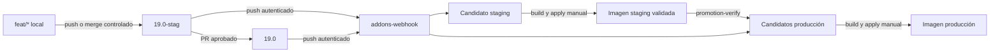

# Plan: Gestión de ramas con staging

| Name | Code | Version | Date | Status |
| --- | --- | --- | --- | --- |
| gestion-ramas-staging | PLAN-004 | R00 | 2026-09-17 | Approved |

## Approach

Se separará la rama de trabajo local de las ramas que representan entornos de servidor. `19.0-stag` y `19.0` seguirán siendo las únicas fuentes automáticas de candidatos para staging y producción; `feat/*` se sincronizará solo bajo una referencia explícita cuando se use el runtime local de desarrollo. La actualización de candidatos seguirá siendo automática por webhook para las dos ramas de servidor, mientras que construir, aplicar, validar y promover imágenes continuará siendo manual.

La promoción verificará que el árbol de cada addon candidato en producción coincide con el árbol validado en staging antes del build productivo. La realineación de `19.0-stag` será un procedimiento Git explícito documentado, no una operación del webhook ni un cambio de Compose.

## Constitution Check

- **Tech Stack**: Conforme. Usa Bash, Make, Python estándar, Git y el webhook existente; no introduce servicios ni dependencias nuevas.
- **Code Principles**: Conforme. Los cambios se concentran en los scripts de candidatos, un verificador de promoción, el Makefile, documentación y pruebas; los contratos se cubren con pruebas que deben fallar ante una rama o procedencia incorrecta.
- **Security**: Conforme. El webhook seguirá aceptando solamente pushes autenticados de `19.0-stag` y `19.0`, conservará la allowlist de repositorios y no obtendrá permisos Git de escritura, Docker ni secretos adicionales.
- **Operational Principles**: Conforme. La aplicación de imágenes, la validación funcional y las operaciones de módulos siguen siendo manuales; staging y desarrollo siguen siendo descartables y producción conserva el backup previo existente.
- **Observability**: Conforme. La imagen validada ya guarda commits de addons; el verificador comparará esos árboles con los candidatos de producción e informará la divergencia antes de una promoción.
- **Performance**: N/A. Las comparaciones Git son puntuales, sobre clones bare existentes y fuera del runtime de Odoo.
- **Dependency Policy**: Conforme. No se agregan paquetes, imágenes ni herramientas externas.
- **Constraints**: No se modifica Compose, redes, volúmenes, secretos, backups ni la arquitectura de stacks. La realineación requiere una operación Git explícita del operador desde un checkout con permiso de escritura.

## NFR Compliance

- **No requerir `19.0-dev`**: `scripts/addons.sh`, el webhook, las pruebas y los runbooks dejan de derivar o aceptar esa rama. Desarrollo recibe una referencia `feat/*` explícita cuando necesita sincronizar candidatos locales.
- **No aplicar automáticamente**: el webhook conservará el alcance actual de publicar candidatos; `build`, `apply-image`, validación y módulos no se invocan desde el receptor.
- **Conservar SHA o procedencia equivalente**: el nuevo verificador comparará los árboles Git de los commits de addons guardados en la imagen validada de staging contra los candidatos de producción; una diferencia bloquea la promoción manual.
- **Realineación explícita y reversible**: el runbook distinguirá avance rápido, realineación y descarte de commits; ningún script de runtime reescribirá ramas remotas ni reaccionará con una realineación automática.
- **Conservar interfaz existente**: `repo-sync`, `build`, `apply-image` y `verify` permanecen; se agrega `promotion-verify` como control previo explícito de producción.

## Architecture



`19.0-stag` representa un conjunto de cambios candidato. Puede incorporar una o más features, pero toda promoción cubre el delta completo hacia `19.0`. Después de promover o descartar cambios, el operador realinea staging de forma explícita con producción antes de iniciar el siguiente ciclo.

El webhook seguirá procesando solo eventos `push`. La tabla de selección queda así:

| Ref recibida | Candidato publicado | Acción no permitida |
| --- | --- | --- |
| `19.0-stag` | `runtime/addons/custom/staging/` | Build, apply o módulos automáticos |
| `19.0` | `runtime/addons/custom/produccion/` | Build, apply o módulos automáticos |
| `19.0-dev` o `feat/*` | Ninguno | Crear candidatos de servidor |

Para desarrollo local, `repo-sync` aceptará una referencia explícita limitada a `feat/*`; staging y producción conservarán sus ramas fijas y rechazarán overrides. Esto evita que una variable de entorno vuelva a seleccionar una rama productiva arbitraria.

## File Structure

```text
.specs/004-gestion-ramas-staging/
├── spec.md                                      ← existente: contrato aprobado
└── plan.md                                      ← nuevo: diseño de implementación
Makefile                                         ← modificado: expone promotion-verify
scripts/addons.sh                                ← modificado: elimina 19.0-dev y admite ref feat/* solo en desarrollo
scripts/promotion-verify.sh                      ← nuevo: compara staging validado con candidatos de producción
stacks/addons-webhook/app/server.py              ← modificado: acepta solo 19.0-stag y 19.0
tests/test_addons.sh                             ← modificado: ramas fijas de servidor y referencia local explícita
tests/test_webhook_addons.sh                     ← modificado: ignora 19.0-dev y feat/*
tests/test_promotion_verify.sh                   ← nuevo: coincidencia, divergencia y validación ausente
docs/entorno/levantar-desarrollo.md              ← modificado: desarrollo local sin 19.0-dev
docs/entorno/levantar-staging.md                 ← modificado: staging desde 19.0-stag
docs/entorno/levantar-produccion.md              ← modificado: promotion-verify antes del build productivo
docs/modulos/gestionar-catalogo-addons.md        ← modificado: contrato de ramas de repositorios de dominio
docs/modulos/gestionar-fork.md                   ← modificado: flujo local → staging → producción y realineación
docs/modulos/validar-promocion.md                ← modificado: validación de staging y promoción del conjunto
docs/modulos/gestionar-ramas-staging.md          ← nuevo: procedimiento manual para publicar, promover y realinear ramas
docs/operacion/operar-webhook-addons.md          ← modificado: allowlist de ramas del receptor
docs/modulos/especificacion-gestion-addons.md    ← modificado: contrato operativo vigente, sin alterar el historial de SPEC-001
ARCHITECTURE.md                                  ← modificado: roles de ramas y realineación de staging
README.md                                        ← modificado: resumen del flujo de ramas vigente
```

## Data Model

No se agrega una base de datos ni un servicio de estado. Se reutilizan los campos existentes de `runtime/staging/state/images.json`:

| Campo existente | Uso en la promoción |
| --- | --- |
| `Actual.addons` | Mapa `dominio → commit` de la imagen de staging validada |
| `validation.result` | Debe ser `ok` para autorizar la verificación de promoción |
| `validation.note` | Evidencia manual del conjunto validado |
| candidatos de `runtime/addons/custom/produccion/` | Commit actual de cada dominio en `19.0` antes del build productivo |

`promotion-verify` comparará el árbol Git de cada commit de `Actual.addons` contra el commit candidato de producción. Se acepta que los SHA difieran si el árbol es idéntico, por ejemplo después de un merge que conserva el contenido. También comprobará edición, tag de edición y procedencia Enterprise cuando correspondan.

## API / Interface Contracts

| Interfaz | Contrato |
| --- | --- |
| `ENTORNO=desarrollo ADDONS_REF=feat/<nombre> make repo-sync` | Sincroniza esa rama solo para el runtime local; rechaza refs fuera de `feat/*`. |
| `ENTORNO=staging make repo-sync` | Sincroniza exclusivamente `19.0-stag`. |
| `ENTORNO=produccion make repo-sync` | Sincroniza exclusivamente `19.0`. |
| `ENTORNO=produccion make promotion-verify` | Requiere una imagen Actual de staging validada y candidatos productivos con árboles equivalentes; falla con el dominio divergente o la procedencia incompatible. |
| Webhook `push` | Publica candidatos solo para `19.0-stag` y `19.0`; devuelve respuesta de evento ignorado para `19.0-dev` y `feat/*`. |
| Realineación de staging | Procedimiento Git manual: avance rápido cuando sea posible; si se descartan commits, recrear o resetear explícitamente `19.0-stag` desde `19.0`, nunca mediante el webhook. |

## Dependencies

None — existing dependencies suffice.

## Risks & Unknowns

- Un PR `19.0-stag → 19.0` con commits adicionales no validados puede cambiar el árbol productivo. Mitigación: ejecutar `promotion-verify` después de `repo-sync` productivo y antes de su build; documentar que la promoción cubre todo el delta.
- Una promoción con una estrategia Git que reescriba SHAs puede conservar el contenido. Mitigación: comparar árboles Git, no exigir igualdad literal de SHA.
- Varios repositorios pueden componer una misma feature. Mitigación: el operador debe publicar todos los commits requeridos en `19.0-stag` y `promotion-verify` debe exigir que todos los dominios validados estén presentes en producción.
- La realineación de una rama remota descarta historia no promovida. Mitigación: documentar verificación previa, uso de una referencia de respaldo y confirmación explícita; no automatizarla.
