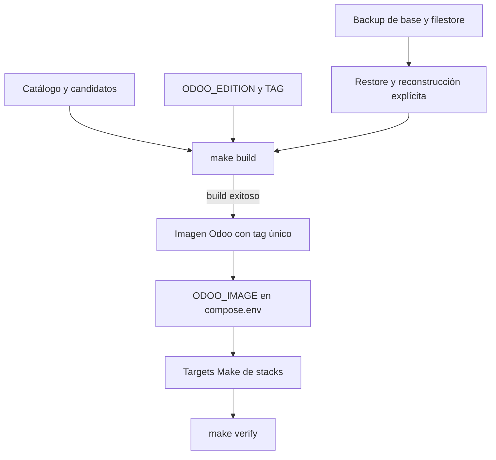

# Plan: Imagen Odoo única por entorno

| Nombre | Código | Versión | Fecha | Estado |
| --- | --- | --- | --- | --- |
| imagen-odoo-simple | PLAN-005 | R01 | 2026-09-17 | Approved |

## Enfoque

Reemplazar la máquina de estados de imágenes por una sola referencia `ODOO_IMAGE` privada en cada `runtime/<entorno>/compose.env`. `make build` construirá la fotografía Odoo con un tag explícito y no flotante, y actualizará esa referencia únicamente después de un build exitoso; el operador levantará los stacks con los targets Make correspondientes y verificará el resultado. Se conservarán los backups de datos, la selección Community/Enterprise, la separación por entorno y la validación funcional manual, pero no se persistirá ni se operará una imagen anterior.

## Verificación de constitución

- **Stack tecnológico**: Conforme. Se mantienen Bash, Make, Docker Compose con `include:` y los tests Bash existentes.
- **Principios de código**: Conforme. Los cambios quedan en los scripts, targets, composiciones, tests y documentación existentes; no agregan servicios ni dependencias y mantienen la salida operativa en español.
- **Seguridad**: Conforme. La referencia de imagen no contiene secretos; se mantienen `secrets:`, los binds y la segmentación de redes actuales. El tag generado no usa `latest` ni otra referencia flotante.
- **Principios operativos**: Conforme con R01. Build, levantamiento, backup, restore y operaciones de módulos siguen siendo decisiones explícitas; la recuperación usa backup de base y filestore más reconstrucción de imagen, sin rollback de imagen.
- **Observabilidad**: Conforme. Cada stack conserva su verificación y `make verify` comprueba la referencia `ODOO_IMAGE` que Compose realmente usa. La procedencia técnica del build se conserva como salida/metadato de diagnóstico sin crear ranuras operativas.
- **Rendimiento**: Conforme. Se conservan límites por contenedor y no se agregan procesos al runtime.
- **Política de dependencias**: Conforme. No se agregan paquetes, gestores, actualizadores automáticos ni mecanismos de backup; la imagen base sigue usando una referencia explícita.
- **Restricciones**: Se mantiene el único servidor, la separación por `COMPOSE_PROJECT_NAME`, la operación manual de módulos y la validación funcional antes de producción.

## Cumplimiento de NFR

- **Una referencia operativa `ODOO_IMAGE` por runtime**: `compose.env` tendrá un único valor; el estado `images.json` dejará de participar en el ciclo de vida.
- **Versión y entorno explícitos, sin tags flotantes**: cada build generará un tag con línea Odoo, entorno, momento UTC y hash de fotografía, y escribirá ese tag como única referencia seleccionada.
- **Sin `images.json`, `Nueva`, `Actual`, `Anterior`, `apply-image` ni `rollback-image`**: se eliminarán las transiciones, las guardas y los comandos que dependan de esas entidades.
- **Actualización solo después de build exitoso**: el tag de la imagen y la referencia en `compose.env` se publicarán después de que Docker devuelva éxito y una identidad verificable; el fallo conservará la referencia previa.
- **Separación por entorno y proyecto Compose**: cada build leerá y actualizará únicamente el `compose.env` resuelto por `ENTORNO`, manteniendo tags y nombres de proyecto distintos.
- **Operaciones funcionales manuales**: `addons-install`, `addons-update`, `addons-uninstall` y la validación funcional no se ejecutarán desde `build` ni desde `up`.
- **Runbooks con fases comunes**: los tres runbooks se ordenarán como Edge, PostgreSQL, Odoo, Backup y Monitoring, marcando como no aplicables los stacks ausentes.

## Arquitectura

El build toma la fotografía inmutable de addons y la edición seleccionada, construye una imagen con tag único y, solo al terminar correctamente, actualiza el selector privado del runtime. Compose consume directamente ese selector. Los backups conservan base, filestore y sus metadatos de backup; no guardan ni restauran una lista de imágenes para seleccionar. `promotion-verify` deja de depender de `images.json` y compara el conjunto de código y edición que se pretende construir en producción con el conjunto validado en staging. Los targets `up` y `odoo-up` ejecutan una precondición antes de invocar Compose para Odoo: la configuración debe resolver una única `ODOO_IMAGE`, la referencia debe ser explícita y no flotante, no puede ser bootstrap y debe existir localmente. Si alguna condición falla, el levantamiento se detiene sin intentar crear el contenedor Odoo.



## Estructura de archivos

```text
.specs/005-imagen-odoo-simple/
└── plan.md                                      ← new: este plan

Makefile                                         ← modified: retirar apply/rollback y adaptar build
ARCHITECTURE.md                                  ← modified: documentar una referencia Odoo por runtime
runtime/desarrollo/compose.env.example           ← modified: retirar bootstrap y documentar el selector único
runtime/staging/compose.env.example               ← modified: retirar bootstrap y documentar el selector único
runtime/produccion/compose.env.example           ← modified: retirar bootstrap y documentar el selector único

scripts/build-odoo-image.sh                      ← modified: tag único por build y actualización atómica de compose.env
scripts/image-state.sh                            ← deleted: eliminar la máquina de estados de imágenes
scripts/odoo-edition-check.sh                    ← modified: quitar dependencia de Actual y validar la imagen/configuración vigente
scripts/odoo-module-operation.sh                 ← modified: quitar requisito e invalidación de rollback de imagen
scripts/promotion-verify.sh                      ← modified: comparar candidatos y edición sin images.json

stacks/backup/scripts/backup.sh                  ← modified: retirar snapshot de imágenes y conservar backup de datos
stacks/backup/scripts/restore.sh                 ← modified: retirar restauración de estado de imágenes
stacks/backup/verify.sh                           ← modified: verificar backup de datos sin exigir images.json
stacks/odoo/compose.yaml                          ← modified: aclarar consumo directo de ODOO_IMAGE
stacks/odoo/verify.sh                             ← modified: validar ODOO_IMAGE y la identidad de la imagen ejecutada

tests/test_addon_operations.sh                   ← modified: operar módulos con la referencia única
tests/test_backup.sh                              ← modified: cubrir backup y restore sin estado de imágenes
tests/test_build_odoo_image.sh                   ← modified: cubrir selección atómica de ODOO_IMAGE
tests/test_edition_transition.sh                 ← modified: cubrir edición sin ranuras de imagen
tests/test_image_state.sh                        ← deleted: retirar tests de transiciones inexistentes
tests/test_promotion_verify.sh                   ← modified: cubrir promoción sin images.json
tests/test_architecture.sh                        ← modified: cubrir el contrato documental y el orden de stacks
tests/test_scripts.sh                             ← modified: retirar contratos de image-state y rollback
tests/test_verify.sh                              ← modified: cubrir verificación de la referencia única
tests/test_docker_smoke.sh                        ← modified: cubrir build y levantamiento con la referencia única

docs/backup-restore/migrar-deployment-externo.md  ← modified: reconstrucción explícita sin rollback
docs/backup-restore/restore-perdida-total.md     ← modified: recuperación por backup y build
docs/backup-restore/restore-staging.md           ← modified: restore sin reintroducir estado de imágenes
docs/credenciales/rotar-credenciales-r2.md       ← modified: retirar referencias operativas obsoletas
docs/credenciales/rotar-token-cloudflare-tunnel.md ← modified: retirar referencias operativas obsoletas
docs/credenciales/rotar-token-git.md             ← modified: retirar referencias operativas obsoletas
docs/entorno/levantar-desarrollo.md              ← modified: flujo por stacks sin apply-image
docs/entorno/levantar-staging.md                 ← modified: flujo por stacks sin apply-image
docs/entorno/levantar-produccion.md              ← modified: flujo por stacks sin apply-image ni rollback
docs/modulos/construir-y-aplicar-imagen.md       ← modified: nuevo contrato build y ODOO_IMAGE
docs/modulos/especificacion-gestion-addons.md    ← modified: eliminar la máquina de estados
docs/modulos/gestionar-enterprise.md             ← modified: aplicar edición mediante build directo
docs/modulos/gestionar-fork.md                  ← modified: actualizar el flujo de build y validación
docs/modulos/gestionar-modulo.md                 ← modified: operar módulos con la referencia única
docs/modulos/gestionar-ramas-staging.md          ← modified: retirar dependencia de imagen Actual
docs/modulos/validar-promocion.md                ← modified: conservar validación de código sin promoción de imagen
docs/operacion/operar-backups.md                 ← modified: backup sin procedencia de slots
docs/operacion/operar-odoo.md                    ← modified: operar la imagen seleccionada directamente
docs/operacion/operar-webhook-addons.md          ← modified: retirar referencias a images.json y aplicación de imagen
```

## Modelo de datos

No se agrega una entidad de estado de imágenes. Cada runtime conserva un único campo privado `ODOO_IMAGE` en `runtime/<entorno>/compose.env`; la referencia apunta a un tag generado por el build y es la única identidad que Compose usa para Odoo. Los datos de base, filestore y metadatos propios del backup permanecen en sus volúmenes y rutas actuales.

## Contratos de interfaz

- `ENTORNO=<entorno> make build`: construye la imagen Odoo y actualiza `ODOO_IMAGE` solo después de un resultado exitoso.
- `ENTORNO=<entorno> make up`: valida la referencia Odoo y levanta la composición completa; Compose no intenta crear Odoo si `ODOO_IMAGE` está ausente o es inválida.
- `ENTORNO=<entorno> make <stack>-up`: levanta un stack individual para respetar el orden Edge → PostgreSQL → Odoo → Backup → Monitoring; `odoo-up` aplica la misma precondición de imagen que `up`.
- `ENTORNO=<entorno> make verify`: valida la imagen seleccionada y los stacks incluidos, sin consultar `images.json`.
- `make validate-image`: se elimina junto con las transiciones de imagen; la validación funcional permanece manual y se registra en el procedimiento operativo correspondiente.
- `ENTORNO=produccion make promotion-verify`: compara el código y la edición candidatos contra el conjunto validado en staging sin requerir una ranura de imagen.

## Dependencias

Ninguna nueva. Se reutilizan Docker, Docker Compose, Bash, Make, Python estándar y los comandos Git ya presentes en el repositorio.

## Riesgos y puntos desconocidos

- Los tags antiguos pueden quedar almacenados localmente después de una reconstrucción; se dejan sin seleccionar y no se eliminan automáticamente para evitar una operación destructiva.
- Los backups existentes que contienen `images.json` dejarán de ser necesarios para el runtime nuevo; el plan debe conservar una lectura tolerante o documentar explícitamente que la recuperación histórica requiere reconstrucción manual.
- La eliminación de `image-state.sh` alcanza scripts, tests y documentación de SPEC-001 y SPEC-002; esos artefactos históricos no se reescribirán salvo que una verificación del repositorio los trate como contratos vigentes.
- La política de edición Community/Enterprise debe seguir bloqueando una combinación incompatible con la base, aun sin usar una imagen `Actual`; el plan debe comprobarlo con una validación de runtime y base independiente.
