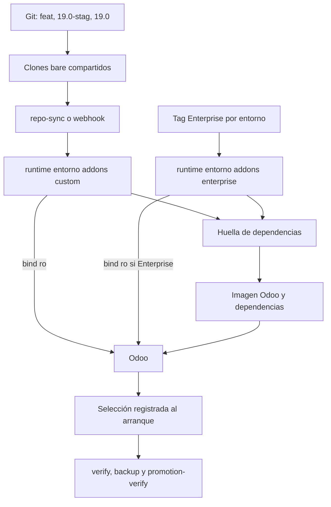

# Plan: Addons mediante bind mount

| Nombre | Código | Versión | Fecha | Estado |
| --- | --- | --- | --- | --- |
| addons-bind-mount | PLAN-006 | R01 | 2026-09-18 | Approved |

## Enfoque

Mover los árboles ejecutables a `runtime/<entorno>/addons/{custom,enterprise}` y montarlos en Odoo como solo lectura, mientras la imagen conserva Odoo, el entrypoint y las dependencias compiladas. Separar la identidad de la imagen de la selección de código: el build registrará huellas de dependencias y el contenedor registrará los commits que encontró al arrancar. Las sincronizaciones, builds, recreaciones y operaciones de módulos compartirán un lock por entorno, sin automatizar reinicios ni cambios funcionales.

## Verificación de constitución

- **Stack tecnológico**: Conforme. Se mantienen Bash, Make, Python estándar, Git, Docker y Docker Compose con `include:`; no se agrega ningún servicio.
- **Principios de código**: Conforme. Compose se validará resuelto para los tres entornos y cada script modificado tendrá cobertura que falle al romper mounts, locks, huellas o procedencia. Toda salida y documentación permanecen en español.
- **Seguridad**: Conforme. Los addons se montan como solo lectura, Enterprise continúa privado y separado por entorno, no se exponen secretos ni el socket Docker y no cambia la segmentación de red.
- **Principios operativos**: Conforme. Build, recreación, backup y operaciones de módulos siguen siendo acciones explícitas; staging y desarrollo permanecen descartables; producción conserva backup y validación previa. La recuperación combina datos, repositorios y una imagen con dependencias compatibles.
- **Observabilidad**: Conforme. `odoo-verify` distinguirá procedencia de imagen, dependencias, candidatos actuales y commits cargados al arranque; `addons-webhook/verify.sh` será dueño de validar sus tres destinos escribibles y la exclusión de Enterprise; el backup registrará el código realmente ejecutado.
- **Rendimiento**: Conforme. No se agregan procesos persistentes ni se modifican límites; las huellas locales evitan reconstruir ante cambios de código sin dependencias nuevas.
- **Política de dependencias**: Conforme. Las dependencias siguen declaradas por cada repositorio, fijadas antes del build e instaladas en una imagen con base explícita; no se instalan paquetes en contenedores activos.
- **Restricciones**: Se conserva un único servidor, tres identidades Compose, operación funcional manual y migración de líneas mayores mediante checkout aislado.

## Cumplimiento de NFR

- **Pruebas sin modificar base ni filestore**: Los tests de rutas, locks, huellas, metadata y Compose usarán fixtures y stubs; el smoke test usará recursos propios descartables.
- **Separación entre entornos**: Cada `compose.env` declarará su `RUNTIME_ADDONS_DIR`; Compose montará solo esa ruta y los tests compararán las tres configuraciones resueltas.
- **Procedencia automática**: La publicación generará marcadores de commit e integridad desde los clones bare; Enterprise registrará su tag y commit al sincronizarse. Ningún archivo requiere edición manual.
- **Huella reproducible de dependencias**: `pydeps` calculará una huella local de las declaraciones relevantes y otra del lock compilado; `image.json` conservará ambas y la referencia base de Odoo, y el preflight las comparará antes de crear Odoo u operar módulos.
- **Commits cargados al inicio**: El entrypoint escribirá `/tmp/odoo-addons-startup.json` antes de iniciar Odoo; la verificación lo comparará con los marcadores montados.
- **Flujo frecuente corto**: Si la huella de dependencias no cambia, el operador ejecutará sincronización, recreación de Odoo y operación manual del módulo cuando corresponda, sin `make build`.

## Arquitectura

El catálogo y los clones bare continúan compartidos bajo `runtime/addons/`. `repo-sync` y el webhook exportan cada commit a `runtime/<entorno>/addons/custom/<dominio>`; Enterprise mantiene un checkout etiquetado independiente en `runtime/<entorno>/addons/enterprise`. Compose monta ambos árboles como solo lectura en las rutas que el entrypoint ya usa y pasa `ODOO_EDITION` para que Community ignore cualquier residuo Enterprise.

La compilación toma una fotografía temporal de esos árboles para resolver dependencias, pero el Dockerfile final no copia addons. La metadata de la imagen registra la referencia base de Odoo y las huellas de entrada y del lock, sin presentar los commits de addons como contenido interno. Antes de `up`, `odoo-up`, `odoo-restart` o una operación de módulo, un preflight valida estructura, integridad, versión base y compatibilidad de dependencias bajo el mismo lock por entorno que usa el webhook. Para Odoo, `restart` significa recrear el contenedor mediante `up -d --force-recreate`; no se usa `docker compose restart`, porque una publicación atómica puede reemplazar el directorio enlazado en el host.

Al arrancar, el entrypoint registra la selección montada. Un webhook posterior puede preparar otro candidato sin reiniciar Odoo; `odoo-verify` mostrará entonces que el runtime necesita recreación. El backup y `promotion-verify` leerán la selección de inicio del contenedor, porque representa el código efectivamente ejecutado y no necesariamente el último candidato publicado.



## Estructura de archivos

```text
.specs/006-addons-bind-mount/
├── spec.md                                      ← modified: especificación aprobada
└── plan.md                                      ← new: este plan

.make/layouts.mk                                  ← modified: lifecycle especial de Odoo con preflight y lock
Makefile                                          ← modified: rutas nuevas, guardas, build y limpieza por entorno
PRINCIPLES.md                                     ← modified: addons montados y dependencias dentro de la imagen
ARCHITECTURE.md                                   ← modified: modelo de código, huellas y selección de runtime

runtime/desarrollo/compose.env.example            ← modified: RUNTIME_ADDONS_DIR de desarrollo
runtime/staging/compose.env.example               ← modified: RUNTIME_ADDONS_DIR de staging
runtime/produccion/compose.env.example            ← modified: RUNTIME_ADDONS_DIR de producción

scripts/addons-runtime.sh                         ← new: validar, inventariar y comparar addons/dependencias
scripts/addons.sh                                 ← modified: publicar custom y Enterprise dentro de cada runtime
scripts/build-odoo-image.sh                       ← modified: construir dependencias sin copiar addons y registrar huellas
scripts/lib/candidate-lock.sh                     ← modified: unificar locks host/webhook por entorno y repositorio
scripts/odoo-edition-check.sh                     ← modified: derivar Enterprise desde el runtime seleccionado
scripts/odoo-lifecycle.sh                         ← new: preflight y up/restart de Odoo bajo lock
scripts/odoo-module-operation.sh                  ← modified: preflight y operación bajo lock compartido
scripts/promotion-verify.sh                       ← modified: comparar producción con commits cargados en staging
scripts/pydeps.sh                                 ← modified: rutas por entorno y huellas de entrada/lock
scripts/vscode-workspace.sh                       ← modified: mostrar addons del runtime seleccionado

stacks/addons-webhook/app/server.py               ← modified: publicar en los tres runtime y usar locks unificados
stacks/addons-webhook/compose.yaml                ← modified: mounts separados para custom de cada entorno
stacks/addons-webhook/verify.sh                   ← modified: validar destinos, permisos y exclusión de Enterprise
stacks/backup/scripts/backup.sh                   ← modified: registrar selección cargada por Odoo
stacks/backup/verify.sh                           ← modified: exigir procedencia ejecutada en el snapshot
stacks/odoo/compose.yaml                          ← modified: binds ro y ODOO_EDITION
stacks/odoo/image/Dockerfile                      ← modified: retirar COPY de addons y conservar wheels/entrypoint
stacks/odoo/image/entrypoint.sh                   ← modified: gate Community/Enterprise y snapshot de arranque
stacks/odoo/verify.sh                             ← modified: mounts, integridad, huellas y drift de candidatos

tests/test_addon_operations.sh                    ← modified: lock y preflight de dependencias
tests/test_addons.sh                              ← modified: rutas por entorno e integridad de candidatos
tests/test_architecture.sh                        ← modified: contratos documentales nuevos
tests/test_backup.sh                              ← modified: procedencia ejecutada en backup
tests/test_build_odoo_image.sh                    ← modified: imagen sin código y metadata de huellas
tests/test_compose.sh                             ← modified: bind ro correcto en los tres entornos
tests/test_contextos.sh                           ← modified: RUNTIME_ADDONS_DIR aislado
tests/test_docker_smoke.sh                        ← modified: mount real y rechazo de escritura
tests/test_edition_transition.sh                  ← modified: Enterprise separado y Community sin residuos
tests/test_promotion_verify.sh                    ← modified: commits cargados en staging contra producción
tests/test_pydeps.sh                              ← modified: huellas y locks por entorno
tests/test_scripts.sh                             ← modified: lifecycle, workspace, nuke y locks
tests/test_verify.sh                              ← modified: drift, integridad y compatibilidad de dependencias
tests/test_webhook_addons.sh                      ← modified: destinos dispersos y exclusión compartida

docs/backup-restore/migrar-deployment-externo.md  ← modified: recuperar addons por entorno
docs/backup-restore/realizar-backup.md            ← modified: procedencia del código ejecutado
docs/backup-restore/restore-perdida-total.md      ← modified: reconstruir imagen y sincronizar mounts
docs/backup-restore/restore-staging.md            ← modified: preparar mounts antes de recrear Odoo
docs/entorno/levantar-desarrollo.md               ← modified: flujo frecuente sin build de código
docs/entorno/levantar-staging.md                  ← modified: mount de 19.0-stag y validación
docs/entorno/levantar-produccion.md               ← modified: mount de 19.0, backup y recreación
docs/modulos/construir-y-aplicar-imagen.md        ← modified: build solo de runtime/dependencias
docs/modulos/especificacion-gestion-addons.md     ← modified: contrato completo de bind mounts
docs/modulos/gestionar-catalogo-addons.md         ← modified: destinos por entorno
docs/modulos/gestionar-dependencias-python.md     ← modified: huellas y criterio de rebuild
docs/modulos/gestionar-enterprise.md              ← modified: checkout etiquetado por entorno
docs/modulos/gestionar-fork.md                    ← modified: publicación sin build ante cambios de código
docs/modulos/gestionar-modulo.md                  ← modified: preflight, recreación y operación manual
docs/modulos/gestionar-ramas-staging.md           ← modified: commits cargados como base de comparación
docs/modulos/validar-promocion.md                 ← modified: staging ejecutado contra candidatos productivos
docs/operacion/operar-backups.md                  ← modified: metadata de addons realmente ejecutados
docs/operacion/operar-odoo.md                     ← modified: lifecycle de addons montados
docs/operacion/operar-webhook-addons.md           ← modified: candidato nuevo y runtime pendiente de recreación
```

## Modelo de datos

- `runtime/<entorno>/addons/custom/<dominio>/.candidate-commit`: commit exportado para cada dominio.
- `runtime/<entorno>/addons/custom/<dominio>/.candidate-tree`: identificador del árbol Git del commit exportado. La validación reconstruye el árbol con semántica Git, excluye `.candidate-commit` y `.candidate-tree`, e incluye rutas, contenido, bit ejecutable y destino de enlaces simbólicos; de ese modo el marcador no es autorreferencial y cualquier edición relevante cambia la huella.
- `runtime/<entorno>/addons/enterprise/`: checkout privado, limpio y desacoplado, fijado al tag de ese entorno.
- `runtime/<entorno>/addons/requirements.lock.txt`: lock compilado para el entorno.
- `runtime/<entorno>/addons/requirements.inputs.sha256`: huella de `requirements.txt`, overrides y declaraciones `external_dependencies.python` relevantes.
- `runtime/addons/builds/<entorno>/<id>/image.json`: metadata de imagen con `odoo_base`, `requirements_inputs_sha256` y `requirements_lock_sha256`; los commits de addons dejan de representar contenido de la imagen.
- `/tmp/odoo-addons-startup.json`: inventario generado por el entrypoint con entorno, edición, dominios, commits, huellas de árbol y Enterprise cargado al inicio.

Todos estos archivos son derivados automáticamente; ninguno es un manifiesto de release mantenido por el operador.

## Contratos de interfaz

- `ENTORNO=<entorno> make repo-sync`: publica `ADDONS_REF` bajo `runtime/<entorno>/addons/custom`, sin build, reinicio ni operación de módulos.
- `make addons-runtime-init`: prepara idempotentemente los tres directorios custom con propietario operador, grupo `65532` y modo `2775`; si necesita privilegios, falla antes de Compose e imprime el comando `install` exacto que debe ejecutar el operador. `addons-webhook-up` ejecuta este preflight antes de levantar el receptor.
- `ENTORNO=<entorno> scripts/addons.sh enterprise-sync <url> <tag>`: selecciona Enterprise solo para ese entorno y conserva checkout limpio, tag anotado y commit verificable.
- `ENTORNO=<entorno> make addons-deps`: valida declaraciones, compila el lock del entorno y escribe ambas huellas; no construye la imagen.
- `ENTORNO=<entorno> make build`: repite la resolución sobre una fotografía estable, construye Odoo y dependencias sin copiar addons y publica metadata/`ODOO_IMAGE` solo al terminar correctamente.
- `ENTORNO=<entorno> make up|odoo-up|odoo-restart`: bajo lock, valida candidatos, referencia base y huella de dependencias, crea o recrea Odoo mediante `up -d --force-recreate` y deja que el entrypoint registre la selección cargada.
- `ENTORNO=<entorno> make addons-install|addons-update|addons-uninstall`: bajo el mismo lock, valida código/dependencias, detiene Odoo, ejecuta el one-off con los mounts y vuelve a levantarlo.
- `ENTORNO=<entorno> make odoo-verify|verify`: compara Compose, filesystem, metadata de imagen y `/tmp/odoo-addons-startup.json`; un candidato posterior produce un fallo accionable de recreación.
- `ENTORNO=produccion make promotion-verify`: compara los commits que el contenedor de staging cargó con los candidatos productivos posteriores al PR, incluida la selección Enterprise.
- El webhook publica solamente custom en el destino del entorno y comparte los locks; no toca Enterprise, imágenes, contenedores, bases ni operaciones de módulos.

## Dependencias

Ninguna nueva. Se reutilizan Bash, Make, Python estándar, Git, Docker y Docker Compose.

## Riesgos y puntos desconocidos

- Un candidato puede cambiar mientras Odoo continúa activo; se mitiga registrando la selección inicial y haciendo fallar la verificación hasta recrear, sin fingir que el proceso recargó Python.
- La huella de entrada debe ignorar cambios de código sin efecto en dependencias y, a la vez, incluir `requirements.txt`, overrides y `external_dependencies.python`; usará un orden canónico y pruebas de mutación.
- Los tres mounts de candidatos del webhook son escribibles por el receptor; `addons-runtime-init` crea o valida sus rutas antes de Compose con propietario operador, grupo `65532` y modo `2775`.
- La validación de promoción dependerá de un staging en ejecución porque ese contenedor es la evidencia de la selección probada; si no está activo, fallará con una causa operativa y no usará el último candidato como sustituto.
- Los backups históricos conservan procedencia con el formato anterior; restore debe tolerarlos como diagnóstico sin tratarlos como selección ejecutable.
